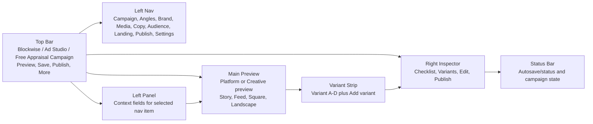
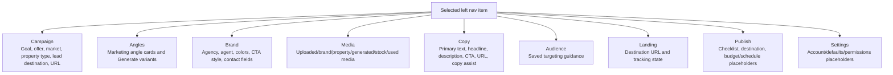
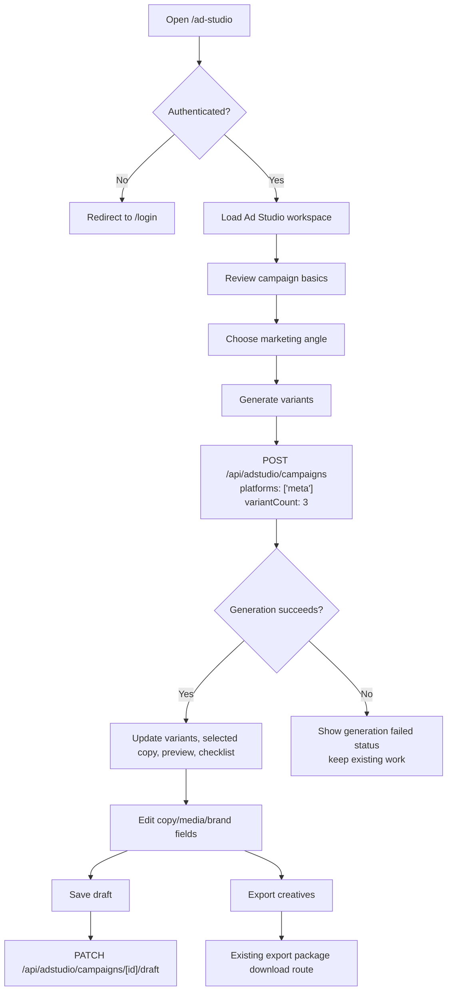
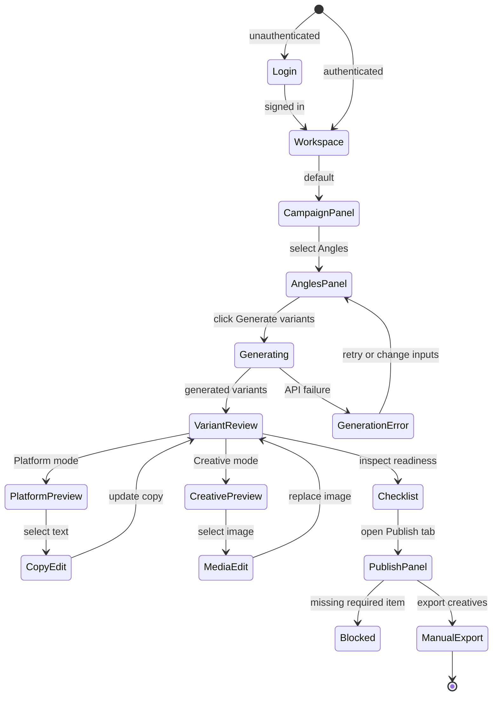

# Ad Studio Built-State Spec

This document describes what is currently built, not the final intended product.
Use it as the review/edit baseline for fixing the Ad Studio flow.

## Current Product Shape

Ad Studio is currently implemented as a protected campaign creative workspace at
`/ad-studio`. Unauthenticated users are redirected to `/login`.

The workspace is a full-screen route-specific UI that visually escapes the
standard authenticated app shell. It is designed around a default campaign:

- Campaign name: `Free Appraisal Campaign`
- Agency: `Northstar Realty`
- Market: `South Perth, WA`
- Default offer: `Free appraisal`
- Default platform generation: Meta only
- Default readiness score: approximately `82%`

The current implementation is mostly client-side UI state with calls into the
existing Ad Studio generation/export APIs.

## Main Screens And Regions



## Desktop Layout

The desktop layout is a fixed full-screen workspace:

- Top bar: logo, breadcrumb, campaign dropdown, Preview, Save, Publish, More.
- Left rail: labeled navigation items, not icon-only.
- Left panel: swaps content based on selected nav item.
- Main preview: centered Meta-style placement or raw creative.
- Bottom variant strip: thumbnails and selected state.
- Right inspector: checklist, variants, edit controls, publish controls.

## Mobile Layout

At mobile widths, the UI changes into a phone-like workspace:

- Top bar with logo, `Ad Studio`, campaign dropdown, and More menu.
- Format tabs: `Story`, `Feed`, `Square`.
- Main preview under the tabs.
- Horizontal variants row.
- Readiness card.
- Bottom nav: `Campaign`, `Variants`, `Checklist`, `Publish`.

Desktop left rail and right inspector are hidden on mobile.

## Navigation Panels



## Campaign Setup Flow



## User Flow Graph



## Preview Behavior

Preview formats:

- `Story · 1080x1920`
- `Feed · 1080x1080`
- `Square · 1080x1080`
- `Landscape · 1200x628`

Preview modes:

- Platform: renders a Meta-style ad frame with avatar, sponsored label, copy,
  media, domain block, headline, description, and CTA.
- Creative: renders the creative asset without the Meta post chrome.

Current edit selection behavior:

- Clicking text-like elements selects text context.
- Clicking image area selects image context.
- Right inspector `Edit` tab changes controls based on selected element.

## Variant Behavior

Initial variants are seeded in the UI:

- Variant A: Direct appraisal
- Variant B: Home value angle
- Variant C: Buyer demand
- Variant D: Market update

Selecting a variant updates:

- selected thumbnail state
- preview image
- preview copy
- edit controls

Selecting an angle and generating variants calls the existing campaign-generation
API with Meta-only inputs.

## Right Inspector

Tabs:

- Checklist: readiness score and launch checklist.
- Variants: variant cards with Preview, Use, Duplicate, Regenerate actions.
- Edit: context controls for text or image selection.
- Publish: formats, destination, budget placeholder, schedule placeholder,
  tracking status, approval status, and export action.

Checklist rows currently include:

- Goal and offer
- Location
- Property type
- Landing page
- Primary media
- Ad copy
- Call to action
- Compliance

## API And Persistence Behavior

Existing behavior reused:

- Campaign generation API is still the existing Ad Studio API.
- Export route is still the existing export package route.
- Auth behavior is unchanged.
- Provider behavior is unchanged and remains Meta-only from the UI.
- Database schema is unchanged.

New additive route:

```text
PATCH /api/adstudio/campaigns/[id]/draft
```

Purpose:

- Save the current campaign pack as a draft.

Response shape:

```text
{
  campaignPack,
  data,
  persistence
}
```

## Current Known Rough Edges

These are likely reasons the app may feel like it does not work properly:

- The campaign is pre-seeded rather than created through a clean first-run flow.
- Several controls are visual placeholders rather than fully wired workflows.
- `Publish` is still manual export/placeholder, not live provider publishing.
- The readiness score is mostly derived from local UI state and defaults.
- The right inspector actions like Duplicate and Regenerate are presentational
  unless attached to the generation/export APIs.
- The mobile bottom nav exposes only the compact flow, so advanced desktop panel
  content is not all reachable from mobile.
- There is no full approval/commenting workflow in the built MVP.
- Visual verification behind authenticated production login still requires a
  valid account/session.

## What This Removes From The Old UI

The built UI intentionally removes these old user-facing concepts:

- template-first entry
- old mode overlay
- prompt-first default experience
- exposed engine/provider label
- freeform editor-first navigation
- old `Brand Kit`, `Editor`, `Export pack`, `AI generated`, `AI helps`,
  `Create your own`, and `Engine: OpenAI` labels

## Review Questions

Use these questions to decide the next fix:

1. Should Ad Studio start with `Create campaign`, or should it always open the
   default `Free Appraisal Campaign`?
2. Which controls must be real for MVP: Save, Publish, Regenerate, Duplicate,
   Replace image, or Approve?
3. Should mobile users edit campaign fields, or only review variants/checklist?
4. Should readiness be calculated from API state, local UI state, or both?
5. Should `Publish` export a file, create a provider draft, or remain blocked
   until approval?
6. Should angle selection immediately generate variants, or wait for an explicit
   `Generate variants` click?
