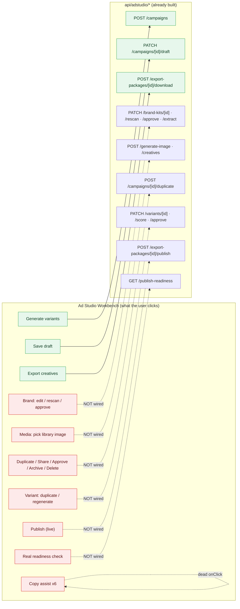
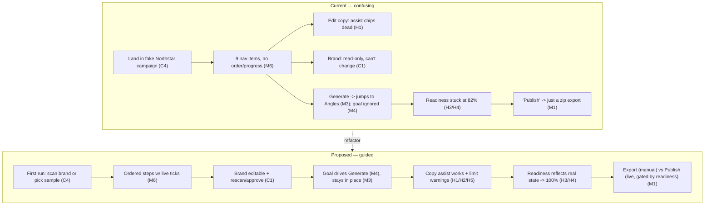
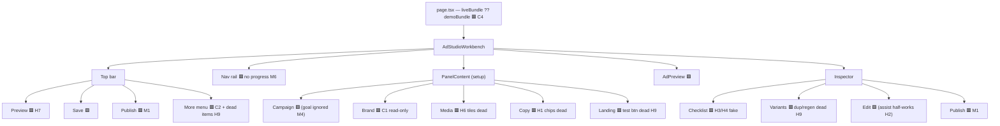

# Blockwise Ad Studio — UX/UI Review & Fix Plan

**Reviewed:** 2 June 2026 · **Surface:** `blockwise.sale/ad-studio` (production) ·
**Code:** `src/components/adstudio/ad-studio-workbench.tsx` (1,762 lines) + `src/app/(customer)/ad-studio/page.tsx` + `src/app/api/adstudio/**`
**Method:** Full code read of the workbench and supporting routes, plus a live click-through of every control as a first-time user (signed in as `operator@blockwise.test`).

---

## TL;DR — the one thing to understand

The Ad Studio is a **beautifully built front-end shell wired to almost nothing.** The visual design is genuinely strong and worth keeping. The problem is that the workbench is effectively a high-fidelity *mockup*: of the **~36 `api/adstudio/*` endpoints that already exist and work**, the UI calls only **three**:

| Wired (works) | Endpoint |
|---|---|
| Generate variants | `POST /api/adstudio/campaigns` → returns `201` ✅ |
| Save draft | `PATCH /api/adstudio/campaigns/[id]/draft` |
| Export creatives | `POST /api/adstudio/export-packages/[id]/download` |

Everything else the user can click — update the brand pack, pick a library image, the six Copy "assist" chips, Duplicate / Share / Approve / Archive / Delete, Regenerate a variant, Test landing page, the real publish-readiness check — is either a dead `<button>` with no `onClick`, or a hard-coded display value. **The backend for most of these is already written** (`brand-kits/[id]` PATCH, `brand-kits/[id]/rescan`, `campaigns/[id]/duplicate`, `variants/[id]`, `export-packages/[id]/publish`, `publish-readiness`…). So the bulk of this plan is **connecting existing UI to existing APIs**, not building new features.

That is good news: the gap between "looks done" and "is done" is mostly wiring.

---

## What's working well (keep this)

- The four-zone layout — **nav rail → setup panel → live preview → inspector** — is the right information architecture for an ad builder.
- The **live ad preview** (Story / Feed / Creative renders with selectable headline/body/CTA hot-spots) is the best part of the product and looks polished.
- **Generate variants** genuinely works end-to-end (calls the API, returns 3 variants, reseeds copy).
- **Save** and **Export creatives** work.
- The **readiness checklist** is the right *concept* (it just needs to be real — see H3/H4).
- A responsive **mobile layout** already exists.

The user's instinct — "I like the design, it just needs to flow better and be more intuitive" — is correct. Almost nothing here needs to be redesigned; it needs to be **connected and sequenced**.

---

## Severity legend

| Level | Meaning |
|---|---|
| 🔴 **Critical** | Blocks a core task, breaks trust, or exposes internal tooling to clients |
| 🟠 **High** | A visible control does nothing / misleads, or a headline number is fake |
| 🟡 **Medium** | Flow & information-architecture confusion; makes the tool feel "weird" |
| ⚪ **Low** | Visual polish, dead code, copy quality |

Counts: **5 Critical · 9 High · 8 Medium · 6 Low** (≈28 distinct issues).

---

## 🔴 Critical

### C1 — The brand pack cannot be updated (the headline complaint)
**What the user sees:** The **Brand** section shows Agency name, Agent name, a logo/colour preview and an "Advanced" disclosure — all read-only. There is **no Edit, Re-scan, Re-extract, Save, or Approve control anywhere.** "Advanced" just expands to a sentence saying everything "stays locked to the approved kit."
**Root cause:** `ad-studio-workbench.tsx` lines **894–921** (`PanelContent`, `section === "brand"`). The inputs are literally `<input value={brand} readOnly />`; the panel only *reads* the `brandKit` prop and is wired to none of the brand APIs.
**Backend already exists:**
- `GET/PATCH /api/adstudio/brand-kits/[id]` (read + update)
- `POST /api/adstudio/brand-kits/[id]/rescan` (re-pull from the website)
- `POST /api/adstudio/brand-kits/[id]/approve`
- `POST /api/adstudio/brand-kits/[id]/assets`
- `POST /api/adstudio/brand-kits/extract`

**Fix:** Make the Brand panel editable and stateful. Lift `brandKit` into component state; turn the read-only fields into editable inputs (name, trading name, phone, colours, website); add three buttons — **Re-scan website** (`rescan`), **Save changes** (`PATCH [id]`), **Approve kit** (`approve`). On save, update local state and re-render the preview. This is the single highest-value fix in the document.

---

### C2 — The "…" overflow menu cannot be closed
**What the user sees:** Click the top-right **…** and the menu opens. Clicking anywhere else does **not** close it. Pressing **Escape** does **not** close it. The only way out is clicking the **…** again. (Verified live.)
**Root cause:** lines **581–616**. The menu is toggled by `onClick={() => setShowMore(v => !v)}` and rendered with `{showMore && (...)}`. There is **no** outside-click listener, **no** Escape handler, **no** backdrop, **no** `ref`.
**Fix:** Add a one-shot effect when open:
```tsx
const menuRef = useRef<HTMLDivElement>(null);
useEffect(() => {
  if (!showMore) return;
  const onDown = (e: MouseEvent) => { if (!menuRef.current?.contains(e.target as Node)) setShowMore(false); };
  const onKey = (e: KeyboardEvent) => { if (e.key === "Escape") setShowMore(false); };
  document.addEventListener("mousedown", onDown);
  document.addEventListener("keydown", onKey);
  return () => { document.removeEventListener("mousedown", onDown); document.removeEventListener("keydown", onKey); };
}, [showMore]);
```
Attach `ref={menuRef}` to `.studio-more-menu` (and ignore clicks on the toggle itself).

---

### C3 — The Vercel Toolbar / Live feedback widget is exposed to clients (and crashes)
**What the user sees:** A floating dark pill (stopwatch + menu icons) pinned to the right edge, and recurring **"INP Issue"** pop-ups ("`svg.lucide.lucide-ellipsis` … blocked UI updates for 206 ms", "`button.studio-btn.publish.block` … 4 ms").
**Root cause:** This is **`vercel.live` / the Vercel Toolbar**, not app code. Console shows it loading from `vercel.live/_next-live/feedback/*` and throwing an **uncaught exception**: `InvalidNodeTypeError: Failed to execute 'selectNode' on 'Range'…`. It is being injected on the production domain.
**Fix (config, not code):** Disable the Vercel Toolbar for production in the Vercel project (Settings → **Toolbar** → off for Production), or remove/guard `@vercel/toolbar` so it only mounts on preview deployments. No end client should see a performance HUD or a feedback widget that errors. *(The 206 ms INP it flagged on the ellipsis icon is a real-ish perf smell too, but the toolbar itself is the bug.)*

---

### C4 — A new user is dropped into a fake "Northstar Realty" campaign with no empty/onboarding state
**What the user sees:** On first load the studio is fully populated with a "Free Appraisal Campaign" for *Northstar Realty / South Perth* — demo data that looks like real saved work. There is no "start here", no empty state, no indication this is sample content.
**Root cause:** `page.tsx` lines **8–22**: `const bundle = liveBundle ?? getAdStudioDemoBundle();`. When the workspace has no live bundle, the **demo bundle renders as if it were the user's own campaign.**
**Fix:** Branch on `liveBundle === null`. For a new workspace, show a first-run state (a "Create your first campaign" / brand-scan step — the `(customer)/onboarding` route already exists) **or** clearly badge the demo as "Sample campaign — edit or start fresh". Never present sample data as the user's saved campaign.

---

### C5 — Landing page: scrolling bounces visitors to `/login` *(carried from prior review — verify root cause)*
**What was reported:** On the public homepage, scrolling navigates the visitor to `/login` every time, making the marketing page unreadable before sign-in.
**Status:** Not reproduced in this pass (the test browser was already authenticated, and this is the landing surface rather than the ad studio). A code scan of `src/components/landing/*` and `src/lib/analytics/*` found **no** scroll-driven `router.push`/redirect, so the most likely cause is **keyboard scroll (Space/PageDown) activating a focused "Client sign in" link**, or a scroll-snap anchor — not an explicit redirect.
**Fix:** Reproduce logged-out, then (a) ensure no CTA/sign-in link receives autofocus on load, (b) confirm `Space`/`PageDown` don't activate a focused anchor, (c) check for any `scroll`/`IntersectionObserver` handler that calls navigation. Flagged Critical because it blocks the entire top-of-funnel, but it lives outside the ad-studio component.

---

## 🟠 High

### H1 — The six Copy "assist" chips are dead
**Seen live:** In **Copy**, clicking *Make sharper / Make more local / Make more premium / Make more direct / Reduce hype / Generate 5 hooks* does nothing — no text change, no toast.
**Root cause:** lines **951–957** render `<button key={label} type="button">{label}</button>` with **no `onClick`**. The *identical* row inside the Inspector → **Edit** tab (lines 1446–1450) *is* wired: `onClick={() => applyCopyAssist(label)}`.
**Fix:** Add the same handler in the Copy panel (thread `applyCopyAssist` into `PanelContent`, then `onClick={() => applyCopyAssist(label)}` at line 953). **But also fix H2 first**, or these chips will misbehave.

### H2 — `applyCopyAssist` only implements 3 of its 6 labels
**Root cause:** lines **535–546**. Only *Make more local*, *Make more direct*, *Reduce hype* have real logic. *Make sharper*, *Make more premium*, and *Generate 5 hooks* all fall through to the `else` branch, which just appends a `?` to the headline. So even the *working* (Inspector) copy of these buttons does the wrong thing for half of them.
**Fix:** Implement each label (or, better, route them to the AI copy endpoint). At minimum map every label to a deliberate transform; "Generate 5 hooks" should produce options, not edit the headline.

### H3 — The readiness score is hard-coded (68 / 74 / 82) and can never reach 100%
**Root cause:** lines **337–341**: returns `68` if no URL, `74` if any item is `todo`, else `82`. With the default demo data it is permanently **82%** ("Great. You are almost ready to publish."), regardless of real progress.
**Fix:** Compute the score from `readinessItems` (e.g. `done = 1`, `warn = 0.5`, `todo = 0`, `score = round(avg × 100)`), so it moves as the user actually completes the campaign and can hit 100%.

### H4 — "Ad copy" and "Call to action" checklist items can never turn green
**Root cause:** lines **327–328**: both use `state: value ? "warn" : "todo"` — there is **no path to `"done"`.** They sit permanently amber even when filled in correctly.
**Fix:** Add real validation: `done` when copy is within Meta limits / a CTA is chosen; `warn` only when present-but-suboptimal; `todo` when empty.

### H5 — Over-limit copy is shown with no warning
**Seen live:** Primary text reads **"143 / 125"** — 18 characters over Meta's limit — in the *same plain grey* as every other counter. Nothing flags it; on a real upload Meta would truncate/reject.
**Root cause:** `CopyFields` line **1473** renders `{copy[key].length} / {COPY_LIMITS[key]}` with no over-limit styling; `updateCopy` never validates.
**Fix:** Turn the counter red and show a warning when `length > limit`; reflect it in the readiness "Ad copy" item (H4) and block/warn at export.

### H6 — Media-library tiles aren't selectable
**Seen live:** In **Media**, the four library images render with an "active" highlight, but clicking a different tile does nothing — the selection stays on the first image.
**Root cause:** lines **934–940**: each tile is a `<button>` with `className={primaryImage === asset.src ? "active" : ""}` but **no `onClick`**. Only the "Replace image" upload works.
**Fix:** `onClick={() => onSelectAsset(asset.src)}` (thread a setter that calls `setPrimaryImage`). The AI `generate-image` endpoint also exists if you want a "Generate image" action here.

### H7 — The "Preview" button is misleading
**Seen live:** Clicking **Preview** only flips the preview back to "Platform" mode (it set `previewMode("platform")`, line **569**) — which does nothing when you're already in Platform, and is redundant with the Platform/Creative toggle sitting right beside it.
**Fix:** Make Preview do what users expect — open a **full-size / device-frame preview** (modal or new tab) — or remove the button.

### H8 — "Feed" and "Square" are the same tab
**Seen live:** Switching between **Feed** and **Square** produces a pixel-identical preview.
**Root cause:** `FORMAT_META` lines **201–202**: both have `kind: "feed"` and `size: "1080x1080"`; their only difference is `imageClass` (`studio-feed-frame` vs `studio-square-frame`) — and **`imageClass` is never read anywhere**, plus those classes don't exist in `STYLES`. So both render through the same `studio-feed-card` path.
**Fix:** Either make Square a true 1:1 crop distinct from the 4:5/feed layout, or remove the redundant tab. Delete the dead `kind`/`imageClass` fields (see L1).

### H9 — ~15 buttons across the workbench have no `onClick`
The file has **50 `type="button"` elements but only 35 `onClick` handlers.** Beyond H1/H6, the silent controls are (see full table in the Appendix): Duplicate / Share for review / Send for approval / Archive / Delete campaign (the "…" menu), **Edit campaign brief**, **Test landing page**, variant-card **Duplicate** & **Regenerate**, **Add variant**, **View all**, **View all recommendations**, and the breadcrumb + mobile campaign "dropdowns".
**Fix:** Wire each to its (mostly existing) endpoint or hide it until built — details and API mapping in the Appendix and roadmap.

---

## 🟡 Medium (the "weird, unintuitive flow")

### M1 — "Publish" doesn't publish
The prominent black **Publish** button (and the Publish nav item, and the Publish inspector tab) all lead to the same place: a panel that says *"Manual export first. Live publishing remains gated"* and offers **Export creatives** (a zip download). A new user reasonably expects "Publish" to push the ads live. Meanwhile the **real** readiness/publish path (`GET /api/adstudio/publish-readiness`, `POST /api/adstudio/export-packages/[id]/publish`) — which checks Meta/Google connection and app-review status — is **never surfaced in the UI.**
**Fix:** Rename the manual action to **Export** (or "Export for upload"). Reserve "Publish" for the gated live flow and drive it from `publish-readiness` so the user sees the *real* checklist ("Connect a Meta ad account", "Enable live publishing"). (Lines 577, 1518–1541.)

### M2 — Too many entry points for the same action
**Publish** has three triggers (top button, nav rail, inspector tab) that do subtly different things; **Generate variants** has three (Campaign panel, Angles panel, mobile). This duplication is a big part of why the flow feels "weird".
**Fix:** One primary trigger per action. Make the nav rail *navigate*, the top bar *act*, and the inspector *inspect* — don't overlap them.

### M3 — "Generate variants" silently teleports you to a different panel
**Seen live:** Clicking **Generate variants** from the **Campaign** panel jumps the left panel to **Angles** (because `generateVariantsForAngle` calls `setSection("angles")`, line **386**). The user set up a campaign and suddenly they're looking at a different screen.
**Fix:** Keep the current section, or make "choose angle → generate" an explicit, visible step rather than a side effect.

### M4 — The Campaign goal you pick is ignored when generating
**Root cause:** The Campaign panel's **Generate variants** uses `selectedAngleId` (default `free_appraisal`), not the **Campaign goal** dropdown (lines **1088–1095**, and `generateVariantsForAngle` ignores `campaignGoal`). Change the goal to "Promote recent sale" and you still get the Free Appraisal angle.
**Fix:** Map `campaignGoal` → goal/angle, or merge the two concepts so the setup actually drives generation.

### M5 — Variant labels are duplicated and don't match the preview
**Seen live:** Generation produced "Variant A: **Direct appraisal**", "Variant B: Investor update", "Variant C: **Direct appraisal**" (A and C share a label). And Variant A's card headline ("Before you list, fix these 10 things") **differs from the live preview headline** ("South Perth seller checklist").
**Root cause:** the cosmetic `angleLabel` math at line **315** (`ANGLES[(index + 6) % ANGLES.length]`) and the fact that the card shows `variant.headline` while the preview shows `meta.headlines[0]` (seeded separately).
**Fix:** Derive labels from the actual variant; keep the variant list and the preview reading from the same source of truth.

### M6 — The nav rail gives no sense of progress or order
Nine sections (Campaign, Angles, Brand, Media, Copy, Audience, Landing, Publish, Settings) with no step numbers, no "done/incomplete" marks, and no indication of which are required. A first-time user doesn't know where to start or when they're finished — and the only "progress" signal (readiness) is a fake number tucked into the inspector.
**Fix:** Add per-section completion ticks (reuse the real readiness state from H3/H4), and/or present the core path as ordered steps (Campaign → Brand → Media → Copy → Publish), with Audience/Landing/Settings as secondary.

### M7 — No empty or loading states
Media tiles, variants, and copy are always pre-populated with demo content, so there's no honest "nothing here yet" or "generating…" state (other than the generate overlay). This compounds C4 and makes it impossible to tell real data from sample data.
**Fix:** Add empty states ("No variants yet — Generate to begin") and skeletons; only show demo content behind an explicit sample badge.

### M8 — Brand preview details are wrong/sloppy
**Seen live:** The brand card renders the phone with no spacing — "Northstar **Realty0899990000**" — and the **Agent name** field shows the same value as **Agency name** (both "Northstar Realty"), because Agent name falls back to `tradingName`.
**Fix:** Format the phone (`(08) 9999 0000`), give the card spacing, and source/label agent vs agency distinctly. (Lines 901–909.)

---

## ⚪ Low (polish & cleanup)

| ID | Issue | Location | Fix |
|---|---|---|---|
| **L1** | Dead config: `FORMAT_META.kind` and `.imageClass` are never read; the `*-frame` classes they name don't exist in `STYLES` | lines 196–204 | Remove the fields, or implement them |
| **L2** | Breadcrumb "Ad Studio / … ▾" looks like a dropdown but is a non-interactive `<span>` | lines 557–562 | Make it a real menu or drop the chevron |
| **L3** | Inspector text clips ("Set in ad accou…", "Needs confirmati…", "Variant C: Direct appraisa…") | Publish/Variants panels | Allow wrap / widen the column |
| **L4** | Demo primary text is ungrammatical ("Download the what is your home worth in today's market?") — poor first impression | `demo-data.ts` | Rewrite sample copy |
| **L5** | Save state is barely visible; footer always reads "Saved just now" | line 549, 795–799 | Show saving / saved / error transitions clearly |
| **L6** | `zustand` "default export is deprecated" warning in console | from `vercel.live` bundle | Resolves once C3 (toolbar) is disabled |

---

## Visual diagrams

### 1. The core problem — UI wired to 3 of ~36 APIs



### 2. Current flow vs. intended flow



### 3. Component map (🟥 = broken / unwired, 🟩 = working)



---

## Prioritized roadmap for the fix

Ordered to rebuild **trust first**, then make controls **real**, then fix **flow**, then **polish**. Effort is rough (1 dev).

### Phase 0 — Stop breaking trust (~½ day, low risk)
1. **C3** Disable the Vercel Toolbar on production (config toggle). Removes the floating HUD, the "INP Issue" pop-ups, and the console exception.
2. **C2** Add outside-click + Escape dismissal to the "…" menu (~10 lines).
3. **H3 + H4** Make the readiness score and the "Ad copy"/"CTA" items compute from real state (can now reach 100%).
4. **H5** Red over-limit counter + warning when copy exceeds Meta limits.
5. **C4 (interim)** Badge demo data as "Sample campaign" until the real empty state ships.

### Phase 1 — Make the visible buttons real (~1–2 days)
6. **C1** Brand pack: editable fields + **Re-scan** (`/rescan`), **Save** (`PATCH /brand-kits/[id]`), **Approve** (`/approve`). *Highest user value.*
7. **H1 + H2** Wire the Copy assist chips and implement all six behaviours (or call the AI copy endpoint).
8. **H6** Make media-library tiles selectable (`setPrimaryImage`); optionally add "Generate image" (`/generate-image`).
9. **H9** Wire the "…" and variant actions to the endpoints that already exist: **Duplicate campaign** → `/campaigns/[id]/duplicate`; variant **Regenerate** → `/campaigns/[id]/generate`; **Archive** → `PATCH /campaigns/[id]`. (See Appendix for the two that need a new endpoint or feature.)
10. **H7** Make "Preview" open a real full-size/device preview (or remove it).

### Phase 2 — Fix the flow & IA (~1–2 days)
11. **M1** Split **Export** (manual zip) from **Publish** (live), and surface the real `publish-readiness` checklist.
12. **M2** Collapse duplicate entry points (one trigger per action).
13. **M3 / M4** Keep the user in place on Generate; make the **Campaign goal** actually drive generation.
14. **M5** Sync variant labels and the preview to one source of truth.
15. **M6 / M7** Add ordered steps + live completion ticks to the nav rail, and real empty/loading states.

### Phase 3 — Polish (~½ day)
16. **H8** Differentiate or remove **Square**; delete dead `kind`/`imageClass` (**L1**).
17. **L2–L6** Breadcrumb, text truncation, sample copy, save-state feedback.

### Outside the studio
18. **C5** Reproduce and fix the landing-page scroll→`/login` issue (logged-out).

---

## Accuracy notes vs. the earlier review

The prior pass was directionally right; a few refinements after reading the source and re-testing live:

- **"18 silent buttons"** → measured **50 `type="button"` vs 35 `onClick`** in the workbench, i.e. **~15 truly silent** controls. The worst cluster (the 6 Copy chips) is confirmed.
- **"Preview is completely broken"** → more precisely, it *forces* `previewMode = "platform"` (line 569). Since Platform is the default, it appears to do nothing — and it duplicates the toggle beside it.
- **"dev INP toolbar"** → it's specifically the **Vercel Toolbar / Live feedback** widget (`vercel.live/_next-live/feedback`), and it's **throwing an uncaught `InvalidNodeTypeError`**. Fix is a Vercel project setting, not app code.
- **"`studio-feed-frame`/`studio-square-frame` don't exist"** → correct, *and* the `imageClass` field that names them is never read anywhere — fully dead config. Feed and Square rendering identically is confirmed live.
- **Hard-coded readiness / 18-over-limit copy / brand pack read-only** → all confirmed (readiness sits at **82%** and can never hit 100%; primary text shows **143/125**; Brand has no write path despite the APIs existing).

---

## Appendix — every silent / dead control (with wiring target)

| # | Control | Line(s) | Today | Suggested wiring |
|---|---|---|---|---|
| 1 | Breadcrumb "Ad Studio / … ▾" | 557–562 | non-interactive `<span>` | Real campaign switcher menu, or drop the chevron |
| 2 | More ▸ Duplicate campaign | 588 | no `onClick` | `POST /api/adstudio/campaigns/[id]/duplicate` ✅ exists |
| 3 | More ▸ Share for review | 597 | no `onClick` | Build share-link feature (no endpoint yet) — hide for now |
| 4 | More ▸ Send for approval | 601 | no `onClick` | Campaign approval flow (`/variants/[id]/approve` exists for variants) |
| 5 | More ▸ Archive campaign | 606 | no `onClick` | `PATCH /api/adstudio/campaigns/[id]` (status) ✅ |
| 6 | More ▸ Delete campaign | 610 | no `onClick` | ⚠️ needs new `DELETE /campaigns/[id]` (only GET/PATCH today) |
| 7–12 | Copy assist ×6 | 951–957 | no `onClick` | `applyCopyAssist(label)` (+ implement H2) |
| 13–16 | Media library tiles ×4 | 934–940 | no `onClick` | `setPrimaryImage(asset.src)` |
| 17 | Test landing page | 995–998 | no `onClick` | Open `destinationUrl` in new tab + validate |
| 18 | Edit campaign brief | 1084–1087 | no `onClick` | Open brief editor (build) |
| 19 | Variant strip ▸ View all | 1339 | no `onClick` | Switch inspector → Variants |
| 20 | Variant strip ▸ Add variant | 1353–1356 | no `onClick` | `POST /campaigns/[id]/generate` (variantCount +1) |
| 21 | Inspector variant ▸ Duplicate | 1418 | no `onClick` | Duplicate variant (variants API) |
| 22 | Inspector variant ▸ Regenerate | 1419 | no `onClick` | `POST /campaigns/[id]/generate` / `/variants/[id]` ✅ |
| 23 | Readiness ▸ View all recommendations | 1509–1512 | no `onClick` | Expand recommendations panel (build) |
| 24 | Mobile campaign button | 731–735 | no `onClick` | Mobile campaign switcher (build) |

✅ = backend already exists · ⚠️ = needs a small new endpoint/feature.

**Confirmed-working controls** (for contrast): Generate variants, Save, Export creatives, format tabs, Platform/Creative & zoom & device toggles, nav-rail navigation, inspector tab switching, variant Preview/Use, preview element selection, and the Inspector → Edit copy fields + assist row.

---

*Generated from a combined source-code read (`ad-studio-workbench.tsx` + `api/adstudio/**`) and a live walkthrough of `blockwise.sale/ad-studio`. Companion interactive version: `ad-studio-ux-review.html`.*

